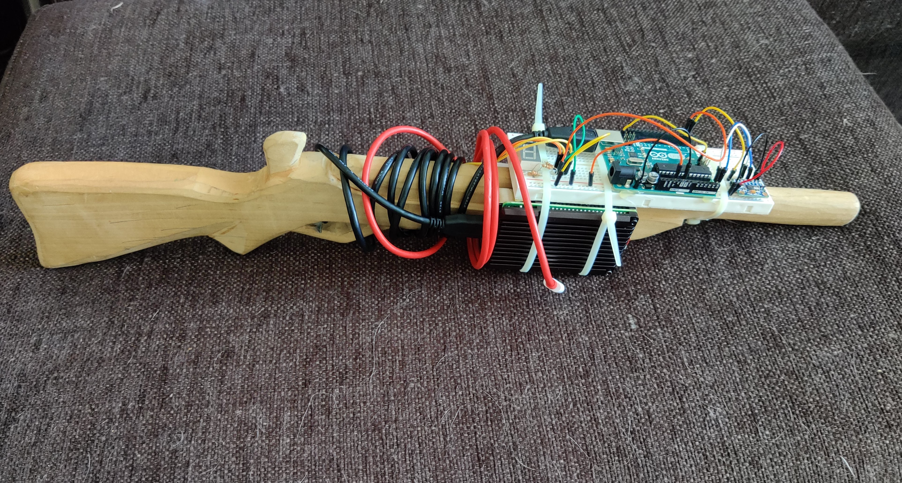
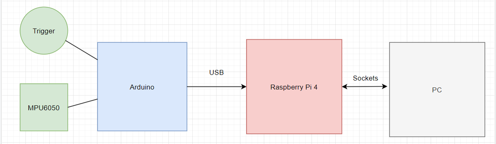
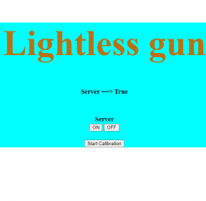

# Game controller


The game controller works as mouse
input device to the PC. Device has
its own website to control when
the controller is on or off and make
calibration to the controller. Project
also includes game made with unity.
Game is designed in mind to be
used with controller.

Shooting gallery game made for this controller:
>https://play.unity.com/mg/other/webgl-builds-45974

Frameworks and languages:
```
- Python
- Flask
- Unity (Game)
- i2c Dev libs (Arduino & MPU6050)
```





MPU6050 and Arduino feeds angles Roll,Pitch, Yawn with USB to Raspberry Pi. In RasbPi angles are converted to pixel values and then send to the client via sockets. In the client pixel values move the mouse and press Left Mouse if controllers trigger is pressed. 




### Web UI


### Input lag and Yaw drift

With no other devices on wifi network the input lag was under 25ms.
Yaw drift with this sensor was around 1 degree per minute.
Yawn drift can be countered while in use by tilting controller 45 degress to oposite direction to correct the mouse placement in screen.


In Nucleo folder is yearlier version of the project using Nucleo with GY-50, GY-61 sensors.